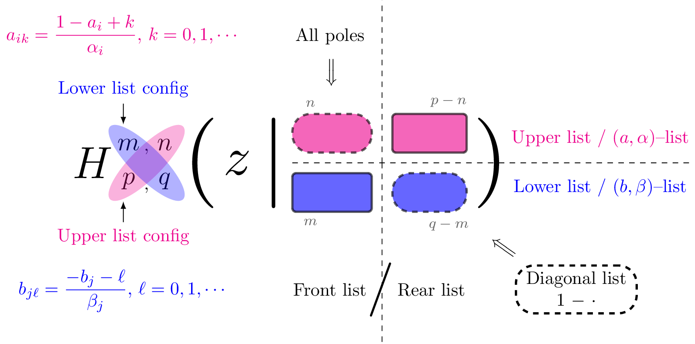
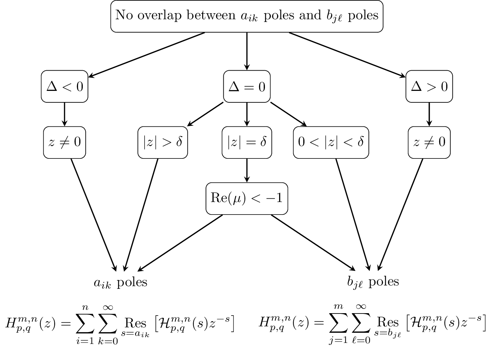
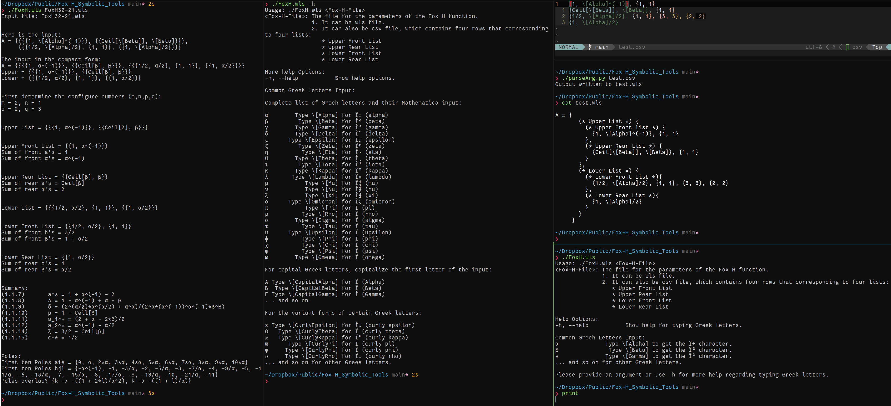

[](https://doi.org/10.5281/zenodo.10143786)




[](https://asciinema.org/a/620136)

# Symbolic computation tools for Fox-H function
1. In this repo, we have some Mathematica codes that are used to show conditions for Fox-H function.
2. The codes are used to verify Theorem C.1 of [arXiv:2206.10069](https://arxiv.org/abs/2206.10069).

# Prerequisites
1. Wolfram Mathematica
2. Python 3.8
3. [lualatex](https://www.luatex.org/) for generating pdf files.
4. Some scripts are written in bash, run in Linux. For Mac OS or Windows, you need to modify the scripts accordingly.

# Usage
1. The input file for the Fox H function can be either csv file or wls file.
  * If the input the file is csv file, it should contain four rows, corresponding four lists:
    * Upper Front List
    * Upper Rear List
    * Lower Front List
    * Lower Rear List
  * Example is here: [test csv](test.csv), where comment lines start with `#`.
```
# Comment line starts with #
{1, \[Alpha]^(-1)}, {1, 1}
{Ceil[\[Beta]], \[Beta]}, {1, 1}
{1/2, \[Alpha]/2}, {1, 1}, {3, 3}, {2, 2}
# The following is the Lower Rear List
{1, \[Alpha]/2}

```
  * Or you can directly write the wls file in the format given in [test.wls](test.wls). Here is one example in the compact form:
```
{
  (* Upper List *) {
    (* Upper Front list *) {{1, \[Alpha]^(-1)}, {1, 1}},
    (* Upper Rear List *)  {{Ceil[\[Beta]], \[Beta]}, {1, 1}}
  },
  (* Lower List *) {
    (* Lower Front List *) {{1/2, \[Alpha]/2}, {1, 1}, {3, 3}, {2, 2}},
    (* Lower Rear List *)  {{1, \[Alpha]/2}}
  }
}
```
  * You can use the python script [parseArg py](./parseArg.py) to convert the csv file to wls file.
  * You can use [PrettyFoxH wls](./PrettyFoxH.wls) to convert the nested list of wls file to the pretty form with comment lines as above.

2. Use [FoxH wls](./FoxH.wls) to compute all conditions:
  * Run
    ```bash
    ./FoxH.wls
    ```
    to see the usage.
  * Run
    ```bash
    ./FoxH.wls --help
    ```
    to see how to type Greek letters.
  * In action, run
    ```bash
    ./FoxH.wls FoxH32-21.wls
    ```
4. The results are stored in [FoxH_Results mx](./FoxH_Results.mx). See the Mathematica Notebook [Result_Handle nb](./Result_Handle.nb) for how to load the results.
5. To load the results from the Mathematica notebook, do the following `<<FoxH_Results.mx`, make sure
```
Quit[] (* start a fresh kernel *)
```
6. Documentation [Fox Parametration pdf](./documentation/FoxH-Parametration.pdf) (Under construction)
7. Several examples are given in [examples](./examples) folder.

# Acknowledgment

We hope that the resources have been supportive in your research endeavors. We
are sincerely grateful for any form of acknowledgment you might extend. Should
you wish to mention this work, a statement such as the one below could be
included in your acknowledgments section or as a footnote:

```
  The author(s) would like to recognize the contribution of the GitHub
  repository chenle02/Fox-H_Symbolic_Tools curated by Le Chen, which has
  supported this research.
```

Or, if you prefer to directly cite this repository, please feel free to use the
following BibTeX entry:

  * Le Chen (2023) “Some symbolic tools for the Fox H-function”. Zenodo. doi: 10.5281/zenodo.10143785.
 
```
@misc{le_chen_2023_10143785,
  author        = {Le Chen},
  title         = {Some symbolic tools for the Fox H-function},
  month         = nov,
  year          = 2023,
  publisher     = {Zenodo},
  doi           = {10.5281/zenodo.10143785},
  url           = {https://doi.org/10.5281/zenodo.10143785}
}
```

Your support in recognizing the effort put into compiling and maintaining this
repository is much appreciated.

# References

1. Conditions and conventions for the Fox H function follow from

  * Kilbas, Anatoly A., and Megumi Saigo. 2004. $H$*-Transforms*. Vol. 9. Analytical Methods and Special Functions. Chapman & Hall/CRC, Boca Raton, FL. <https://doi.org/10.1201/9780203487372>.

2. Related papers that use this code include:

  * Chen, Le, Yuhui Guo, and Jian Song. 2022. "Moments and Asymptotics for a Class of SPDEs with Space-Time White Noise." *Preprint arXiv:2206.10069, to Appear in Trans. Amer. Math. Soc.* <https://www.arxiv.org/abs/2206.10069>.
  * Chen, Le, Guannan Hu, Yaozhong Hu, and Jingyu Huang. 2017. "Space-Time Fractional Diffusions in Gaussian Noisy Environment." *Stochastics* 89 (1): 171--206. <https://doi.org/10.1080/17442508.2016.1146282>.
  * Chen, Le, Yaozhong Hu, and David Nualart. 2019. "Nonlinear Stochastic Time-Fractional Slow and Fast Diffusion Equations on $\mathbb{R}^d$." *Stochastic Process. Appl.* 129 (12): 5073--5112. <https://doi.org/10.1016/j.spa.2019.01.003>.

3. The original paper by Fox on this special function:

  * Fox, Charles. 1961. "The $G$ and $H$ Functions as Symmetrical Fourier Kernels." *Trans. Amer. Math. Soc.* 98: 395--429. <https://doi.org/10.2307/1993339>.

4. Bib entries can be found [here](./refs/refs.bib). References are produced using the reference bank: [SPDEs-Bib](https://github.com/chenle02/SPDEs-Bib).

# How to contribute

Contributions are what make the open-source community such an amazing place to learn, inspire, and create. Any contributions you make are **greatly appreciated**.

If you have a suggestion that would make this better, please fork the repo and create a pull request. You can also simply open an issue with the tag "enhancement".
Don't forget to give the project a star! Thanks again!

1. Fork the Project
2. Create your Feature Branch (`git checkout -b feature/AmazingFeature`)
3. Commit your Changes (`git commit -m 'Add some AmazingFeature'`)
4. Push to the Branch (`git push origin feature/AmazingFeature`)
5. Open a Pull Request

Alternatively, see the issues section to report any bugs or file feature requests, or just send me an email (chenle02@gmail.com) for any other inquiries or further discussion.

# LICENSE
[MIT License](LICENSE)
